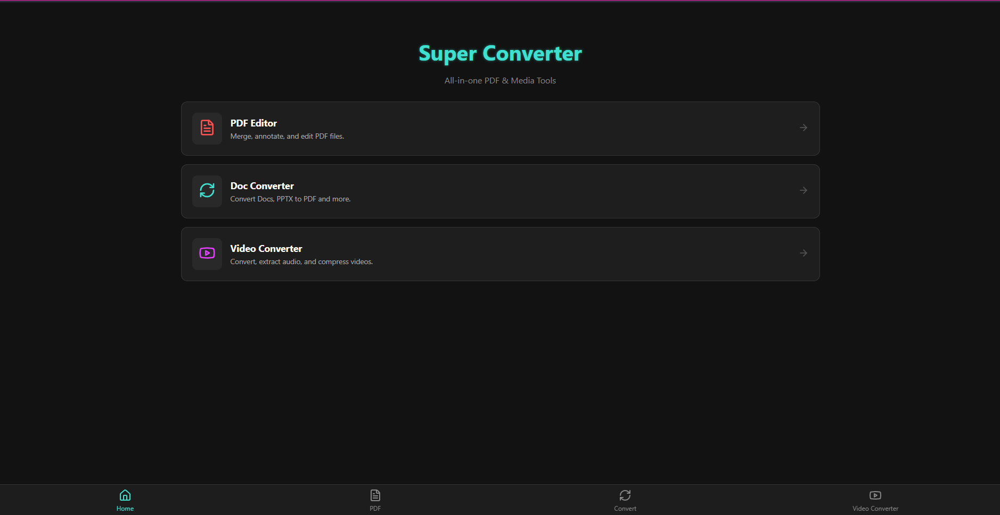
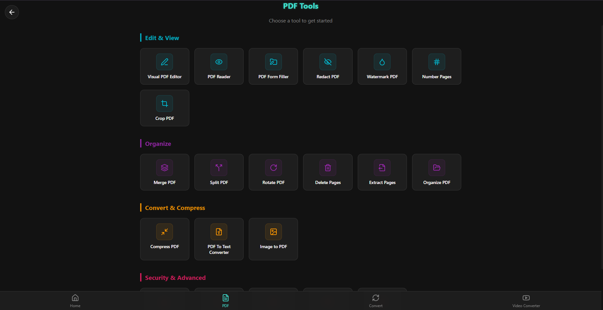
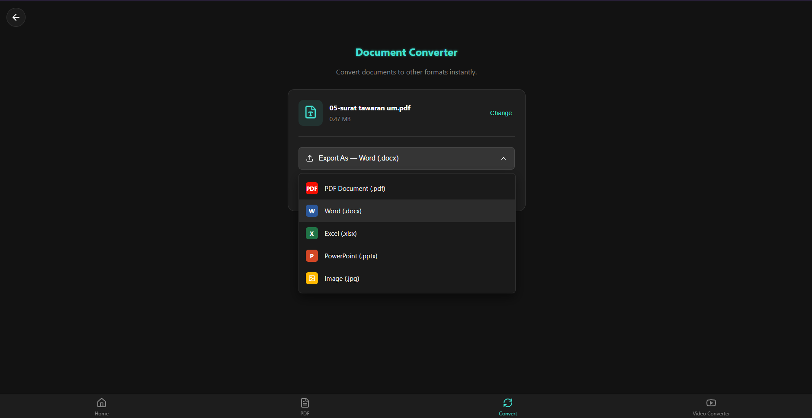
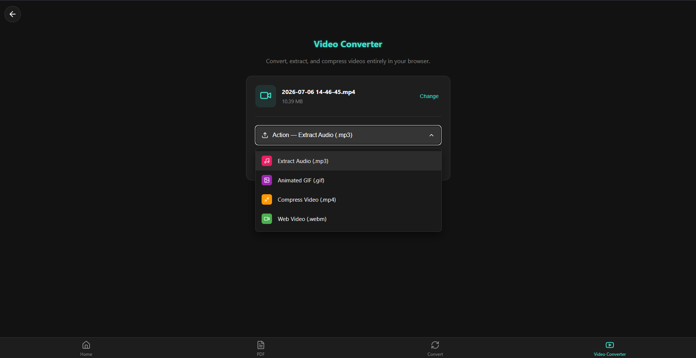
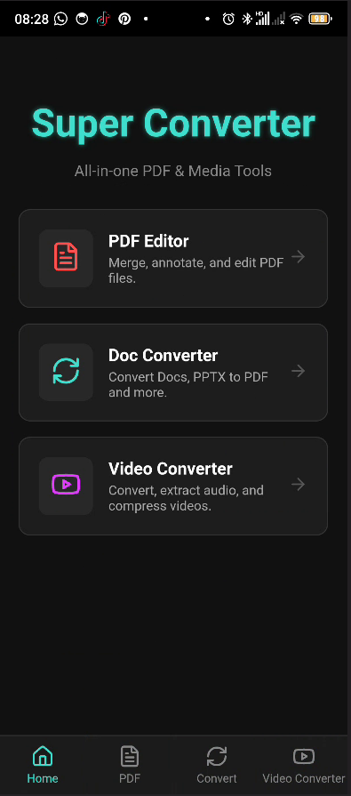
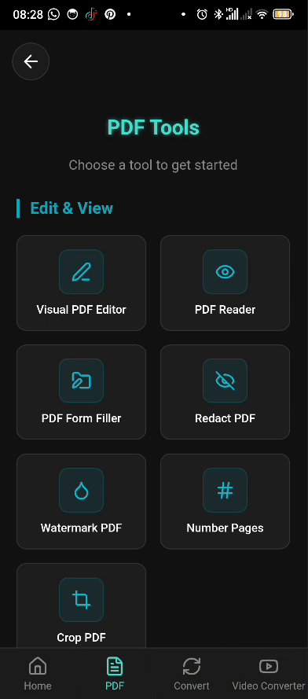
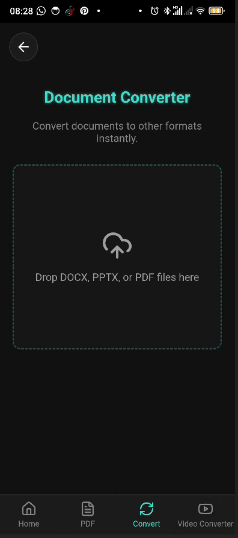
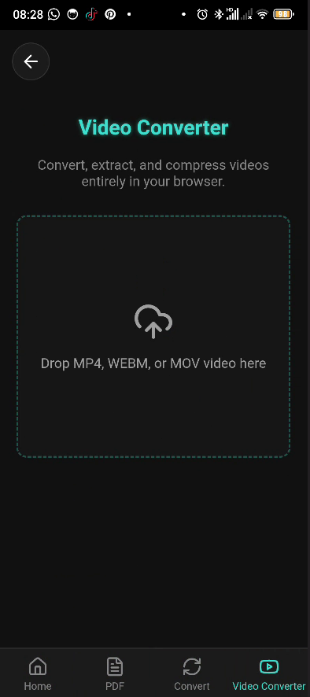

# Super Converter App

A sleek, neon-themed cross-platform application for PDF editing, document conversion, and video processing. Powered entirely by client-side JavaScript and WebAssembly, this app processes files locally on your device for unmatched privacy and speed—no backend servers required!

## 📸 Screenshots

### Web Version
| View 1 | View 2 | View 3 | View 4 |
|:---:|:---:|:---:|:---:|
|  |  |  |  |

### Mobile (Android) Version
| View 1 | View 2 | View 3 | View 4 |
|:---:|:---:|:---:|:---:|
|  |  |  |  |

---

## ✨ Features

### 1. 100% Offline Architecture
* **WebAssembly Power**: Utilizes `ffmpeg.wasm` for heavy video transcoding directly in the browser's CPU.
* **Client-Side Document Parsing**: Uses `pdf.js`, `mammoth`, and `docx` to parse and build documents locally.
* **Privacy First**: Files never leave your device.

### 2. Video Converter & Compressor
* **Extract Audio**: Instantly strip the audio track from videos into an MP3.
* **Create GIFs**: Compress and convert video clips into animated GIFs.
* **Compress Video**: Use the x264 codec to significantly reduce MP4 file sizes.
* **Web Optimization**: Convert heavy videos into highly-optimized VP9 WebM format.

### 3. Ultimate PDF Toolkit
* Merge, Split, and Delete PDF pages.
* Compress PDFs and Organize layouts.
* Add Watermarks, Page Numbers, and Annotations.
* Redact sensitive information and Crop pages.
* Fill PDF Forms and Add Passwords/Protections.

### 4. Document Converter
* **PDF to Office**: Extract text/images and generate `.docx`, `.pptx`, or `.xlsx` files.
* **Office to PDF**: Parse `.docx` files and output standard PDF documents.

---

## 🚀 Getting Started

### 1. Install Dependencies
```bash
npm install
```

### 2. Run Web Development Server
```bash
npm run dev
```

### 3. Build for Android (Capacitor)
To build and run this application natively on Android, you need Android Studio and the Android SDK installed.
```bash
# Build the production web bundle
npm run build

# Sync the web bundle with the native Android project
npx cap sync android

# Open Android Studio to compile and run
npx cap open android
```

## 🛠️ Android SDK Requirements
If you are building for mobile, ensure your environment is set up:
1.  **Download Android Studio**: [https://developer.android.com/studio](https://developer.android.com/studio)
2.  **Install SDK Platforms**: Install **Android 10 (API Level 29)** or higher (Android 14 / API 34 is recommended).
3.  **Install SDK Tools**:
    * Android SDK Build-Tools
    * Android SDK Command-line Tools
    * Android Emulator
    * Android SDK Platform-Tools
